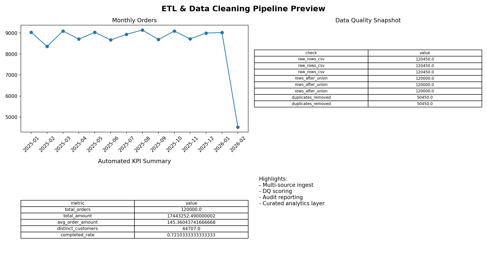

# ETL & Data Cleaning Pipeline (High-End)

Production-style ETL and data quality project (Dec 2025 - Feb 2026).

## What Makes This High-End
- Multi-source extraction from CSV raw files plus simulated DB sync extract.
- Large-scale processing with **120K+ order base records** and customer master enrichment.
- Strict transformation logic for missing data, invalid values, duplicates, and schema consistency.
- Data quality framework with completeness, uniqueness, and validity scoring.
- Automated reporting suite for status, customer tier, and monthly performance.

## Run
```bash
python scripts/generate_raw.py
python src/etl_pipeline.py
python src/reporting.py
```

## Key Outputs
- `/Users/abhishekkumar/Documents/Projects/etl-data-cleaning-pipeline/data/staging/staged_orders.csv`
- `/Users/abhishekkumar/Documents/Projects/etl-data-cleaning-pipeline/data/curated/curated_orders.csv`
- `/Users/abhishekkumar/Documents/Projects/etl-data-cleaning-pipeline/reports/data_quality_report.csv`
- `/Users/abhishekkumar/Documents/Projects/etl-data-cleaning-pipeline/reports/automated_kpi_report.csv`
- `/Users/abhishekkumar/Documents/Projects/etl-data-cleaning-pipeline/reports/automated_kpi_report_monthly.csv`

## Portfolio Preview


## Recruiter Case Study
- `/Users/abhishekkumar/Documents/Projects/etl-data-cleaning-pipeline/docs/CASE_STUDY.md`
